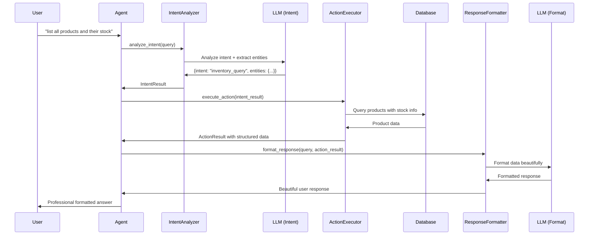
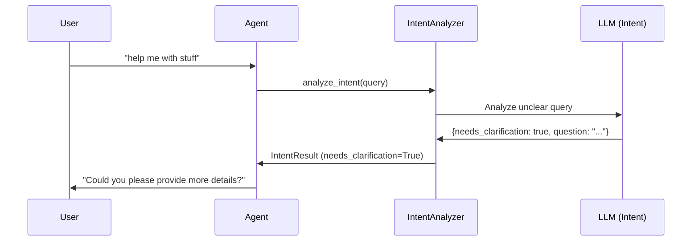

# Wholesale AI Agent Architecture

## Overview

The Wholesale AI Agent is built using a **three-stage LLM-powered architecture** that provides superior natural language understanding, clean separation of concerns, and beautiful response formatting. This document explains the design principles, components, and data flow of the system.

## Design Philosophy

### Core Principle: **LLM → App → LLM**

The architecture follows a clear separation of responsibilities:

1. **LLM for Intent Understanding**: Uses advanced language models to understand user intent and extract entities
2. **App for Business Logic**: Executes pure business operations and data retrieval
3. **LLM for Response Formatting**: Creates beautiful, user-friendly responses from structured data

### Key Benefits

- **Superior Natural Language Understanding**: Replaces rigid regex patterns with flexible LLM comprehension
- **Interactive Experience**: Asks follow-up questions when user intent is unclear
- **Clean Architecture**: Complete separation between business logic and presentation
- **Consistent Experience**: Same flow for all query types
- **Professional Responses**: Beautiful formatting with business insights

## Architecture Components

```
┌─────────────────┐    ┌──────────────────┐    ┌─────────────────────┐
│   User Query    │───▶│  Intent Analyzer │───▶│  Action Executor    │
│                 │    │                  │    │                     │
│ "list products" │    │ LLM understands  │    │ Executes business   │
│                 │    │ intent & extracts│    │ operations          │
└─────────────────┘    │ entities         │    │                     │
                       └──────────────────┘    └─────────────────────┘
                                                           │
┌─────────────────┐    ┌──────────────────┐              │
│ Formatted       │◀───│ Response         │◀─────────────┘
│ Response        │    │ Formatter        │
│                 │    │                  │
│ Beautiful user- │    │ LLM formats      │
│ friendly output │    │ structured data  │
└─────────────────┘    └──────────────────┘
```

## Component Details

### 1. Intent Analyzer (`intent_analyzer.py`)

**Responsibility**: Use LLM to understand user intent and extract relevant entities.

#### Input
- Raw user query (natural language string)

#### Process
1. Sends query to LLM with structured prompt
2. LLM analyzes intent and extracts entities
3. Returns structured `IntentResult` with confidence score
4. Identifies when clarification is needed

#### Output
```python
IntentResult(
    intent_type="inventory_query",
    confidence=0.9,
    entities={
        "product_name": "laptop stand",
        "action": "check",
        "quantity": None
    },
    needs_clarification=False,
    clarification_question=None
)
```

#### Available Intent Types
- `inventory_query`: Check stock levels, inventory status
- `product_search`: Find specific products or browse catalog  
- `inventory_management`: Add, remove, or adjust stock quantities
- `analytics`: Business analytics, sales data, trends
- `supplier_query`: Information about suppliers
- `price_query`: Product pricing information
- `low_stock_alert`: Check products with low/out-of-stock status
- `general`: Unclear requests that need clarification

#### LLM Prompt Strategy
Uses a structured system prompt that:
- Defines all available intents with descriptions
- Requires JSON response format
- Includes confidence scoring guidelines
- Handles clarification scenarios

### 2. Action Executor (`action_executor.py`)

**Responsibility**: Execute business operations based on analyzed intent.

#### Input
- `IntentResult` from Intent Analyzer

#### Process
1. Routes to appropriate handler based on intent type
2. Executes database queries and business operations
3. Handles business logic and validation
4. Returns structured data without formatting

#### Output
```python
ActionResult(
    success=True,
    action_type="inventory_query",
    data=[
        {
            "sku": "ELE-1185-001",
            "name": "Laptop Stand", 
            "current_stock": 432,
            "wholesale_price": 214.27
        }
    ],
    message="Found 1 product matching 'laptop stand'"
)
```

#### Handler Methods
- `_handle_inventory_query()`: Stock queries, product lookups
- `_handle_product_search()`: Product catalog searches
- `_handle_inventory_management()`: Stock add/remove/adjust operations
- `_handle_analytics()`: Business intelligence queries
- `_handle_supplier_query()`: Supplier information
- `_handle_price_query()`: Pricing information
- `_handle_low_stock_alert()`: Stock alert queries

#### Business Logic Examples
- **Stock Validation**: Prevents removing more stock than available
- **Product Lookup**: Searches by name, SKU, or description
- **Inventory Calculations**: Updates stock levels with proper audit trails
- **Data Aggregation**: Calculates analytics and business metrics

### 3. Response Formatter (`response_formatter.py`)

**Responsibility**: Format structured data into beautiful, user-friendly responses.

#### Input
- Original user query
- `ActionResult` from Action Executor

#### Process
1. Takes structured business data
2. Uses LLM to format into beautiful response
3. Adds business insights and context
4. Handles error formatting gracefully

#### Output
Professional, formatted responses like:

```
📦 Stock Information for Laptop Stand:

• SKU: ELE-1185-001
• Current Stock: 432 units
• Wholesale Price: $214.27
• Status: Well Stocked ✅

Business Insight: Stock levels are healthy with 432 units available.
```

#### LLM Prompt Strategy
Uses a system prompt that:
- Emphasizes professional but friendly tone
- Requests clear organization (bullets, tables, numbers)
- Encourages business insights
- Prohibits technical data structures in output
- Specifies appropriate emoji usage

#### Fallback Responses
When LLM formatting fails, provides structured fallback responses:
- Error messages with appropriate icons
- Basic formatted lists and summaries
- Essential information without complex formatting

## Data Flow

### Successful Query Flow



### Clarification Flow



## Integration Points

### Database Integration
- Uses SQLAlchemy ORM for database operations
- Supports multiple database backends (SQLite, PostgreSQL, MySQL)
- Implements proper transaction handling and connection management

### LLM Integration
- Unified `LLMClient` supporting multiple providers (OpenAI, Anthropic, local models)
- Automatic configuration loading from environment variables
- Graceful fallback when LLM services are unavailable

### Inventory Management
- Integrates with existing `InventoryManager` for stock operations
- Maintains audit trails for all inventory changes
- Supports different movement types (INBOUND, OUTBOUND, ADJUSTMENT, DAMAGED)

## Error Handling

### Intent Analysis Errors
- JSON parsing failures → Fallback to clarification request
- LLM service unavailable → Request user to rephrase
- Invalid intent types → Default to general intent with clarification

### Action Execution Errors
- Business rule violations (insufficient stock) → Clear error messages
- Database connectivity issues → Graceful error responses
- Invalid parameters → Validation error messages

### Response Formatting Errors
- LLM formatting failures → Structured fallback responses
- Missing data → Appropriate "not found" messages
- Timeout issues → Simplified response format

## Configuration

### Environment Variables
```bash
# LLM Configuration
LLM_PROVIDER=openai                    # or anthropic, local
LLM_API_KEY=your_api_key_here         # API key for LLM service
LLM_MODEL=gpt-3.5-turbo               # Model to use
LLM_MAX_TOKENS=1000                   # Maximum response length
LLM_TEMPERATURE=0.7                   # Response creativity (0.0-1.0)

# Database Configuration
DATABASE_URL=sqlite:///wholesale_agent.db
```

### Logging
- Structured logging with different levels for each component
- Debug logs for intent analysis and action execution
- Error tracking for troubleshooting
- Performance metrics for optimization

## Extension Points

### Adding New Intent Types
1. Add intent type to `IntentAnalyzer.available_intents`
2. Implement handler in `ActionExecutor._handle_[intent_type]()`
3. Add fallback formatter in `ResponseFormatter._fallback_[intent_type]_response()`

### Custom Business Logic
- Extend `ActionExecutor` with new handler methods
- Add custom validation rules
- Implement domain-specific calculations

### Response Customization
- Modify LLM system prompts for different formatting styles
- Add custom fallback response templates
- Implement multi-language support

## Performance Considerations

### Optimization Strategies
- **Database Query Optimization**: Limit results, use appropriate indexes
- **LLM Call Efficiency**: Structured prompts, appropriate token limits
- **Caching**: Response caching for repeated queries (future enhancement)
- **Async Processing**: Background processing for long-running operations (future enhancement)

### Scaling Considerations
- **Horizontal Scaling**: Stateless components support load balancing
- **Database Scaling**: Read replicas for query-heavy workloads
- **LLM Rate Limiting**: Built-in error handling for API limits
- **Memory Management**: Efficient data structures, proper cleanup

## Security

### Data Protection
- No sensitive data in LLM prompts
- Proper parameterized queries prevent SQL injection
- Environment variable configuration for secrets

### Access Control
- Database connection security
- API key management best practices
- Input validation and sanitization

## Testing Strategy

### Unit Tests
- Intent analysis accuracy
- Business logic validation
- Response formatting consistency

### Integration Tests
- End-to-end query processing
- Database operation verification
- LLM service integration

### Performance Tests
- Query response times
- Database query optimization
- Memory usage monitoring

## Future Enhancements

### Planned Features
- **Conversation Memory**: Multi-turn conversation context
- **Advanced Analytics**: Predictive inventory management
- **Multi-language Support**: International business operations
- **Voice Integration**: Speech-to-text query processing
- **Real-time Notifications**: Proactive stock alerts

### Architecture Evolution
- **Microservices**: Component separation for independent scaling
- **Event Sourcing**: Complete audit trail of all operations
- **GraphQL API**: Flexible query interface
- **Machine Learning**: Predictive analytics and demand forecasting

---

## Quick Start Example

```python
from wholesale_agent.core import WholesaleAgent

# Initialize agent with automatic configuration
agent = WholesaleAgent()

# Process various query types
queries = [
    "list all products and their stock",           # Inventory query
    "add 5 units of laptop stand",                # Inventory management  
    "what are our low stock products?",           # Stock alerts
    "show me business analytics",                 # Analytics
    "help me find wireless headphones"            # Product search
]

for query in queries:
    response = agent.process_query(query)
    print(f"Query: {query}")
    print(f"Response: {response}\n")
```

This architecture provides a robust, scalable, and user-friendly foundation for wholesale business management operations with the flexibility to grow and adapt to changing business needs.